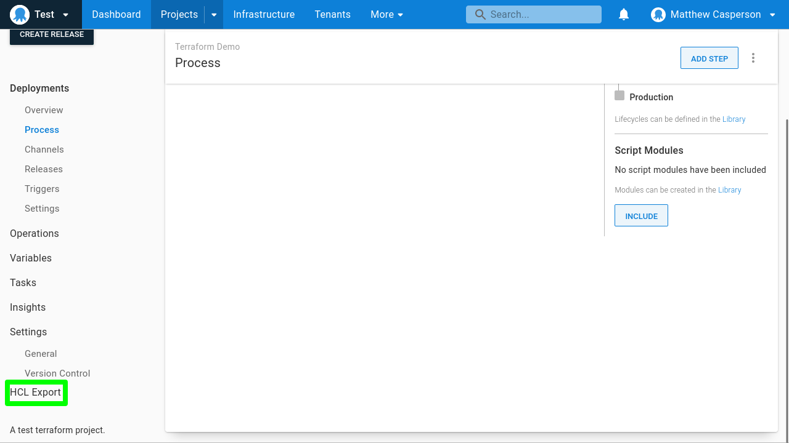

# Octopus Terraform Exporter


This app exports an Octopus space to the associated Terraform resources for use with the 
[Octopus Terraform Provider](https://registry.terraform.io/providers/OctopusDeployLabs/octopusdeploy).

## Downloads

Get the compiled binaries from the [releases](https://github.com/OctopusSolutionsEngineering/OctopusTerraformExport/releases).

## Support

This tool is part of a pilot programme to support platform engineering teams.

The Octopus support teams will make reasonable endeavours to support teams that wish to use this tool. However, existing support Service Level Agreements (SLAs) do not apply to `octoterra`,
and should not be relied on for production deployments.

## Usage

To export a complete space, use the following command:

```bash
./octoterra \
    -url https://yourinstance.octopus.app \
    -space Spaces-## \
    -apiKey API-APIKEYGOESHERE \
    -dest /tmp/octoexport
```

To export a single project and it's associated dependencies, use the following command:

```bash
./octoterra \
    -url https://yourinstance.octopus.app \
    -space Spaces-## \
    -apiKey API-APIKEYGOESHERE \
    -projectId Projects-1234 \
    -dest /tmp/octoexport
```

Projects can also be exported using data source lookups to reference existing external resources rather than creating them. 
This is useful when exporting a project to be reimported into a space where all the existing resources like environments, accounts,
feeds, git credentials, targets, and worker pools already exist.

To do so, use the following command:

```bash
./octoterra \
    -url https://yourinstance.octopus.app \
    -space Spaces-## \
    -apiKey API-APIKEYGOESHERE \
    -projectId Projects-1234 \
    -lookupProjectDependencies \
    -dest /tmp/octoexport
```

## Browser usage

Exporting projects to HCL can be embedded in the browser by using the [Violentmonkey](https://violentmonkey.github.io/)
script [violentmonkey.js](wasm/violentmonkey.js).


This script adds a `Export HCL` link to the project page. Once the link is ready to be clicked (it takes a minute or
so to build the HCL), the link displays the project's HCL representation in a popup window.



## To Do

The following resources have yet to be exported:
* octopusdeploy_scoped_user_role
* octopusdeploy_team
* octopusdeploy_user
* octopusdeploy_user_role

Features:
* Exclude channels
* Exclude triggers
* Ignore tenanted, versioning
